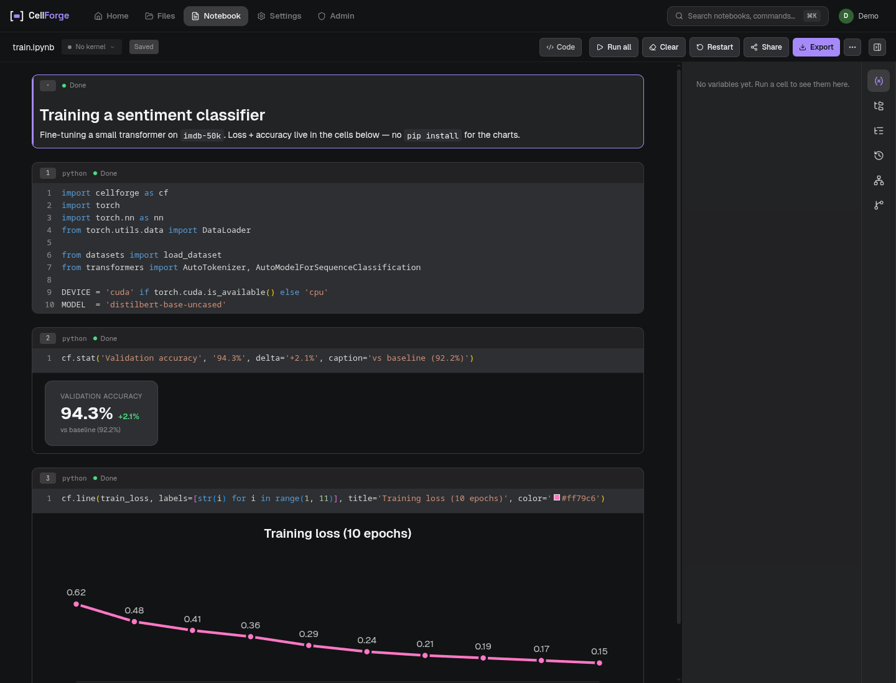
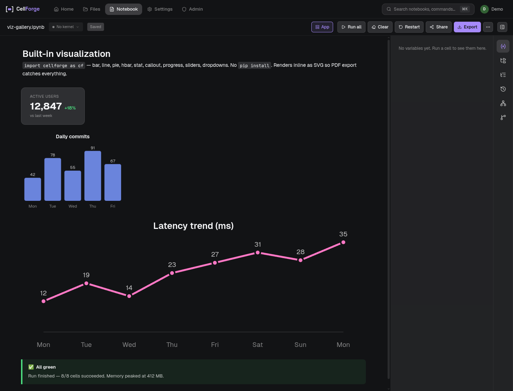
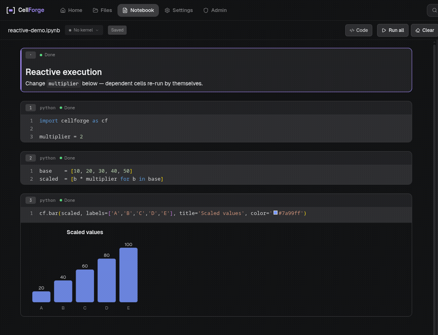

# CellForge

> A notebook IDE that fits in 60 MB. Real Jupyter kernels, reactive cells,
> built-in charts and PDF export — all bundled. One binary, no JupyterHub,
> no TeX Live.


**[Getting Started](https://github.com/Subbok/CellForge/wiki/Getting-Started)** · **[Wiki](https://github.com/Subbok/CellForge/wiki)** · **[Releases](../../releases)**



---

## Install

```bash
curl -fsSL https://github.com/Subbok/CellForge/releases/latest/download/cellforge-linux-x64 \
  -o cellforge && chmod +x cellforge && ./cellforge
```

Server boots at `http://localhost:8888`. Single file, frontend and Typst
compiler embedded. Binary releases for Linux, macOS, and Windows (x64 and
ARM) — see [Releases](../../releases). Docker images, AppImage, .dmg, and
.exe variants are all there too.

You need one Jupyter kernel available: `pip install ipykernel` is enough
for a Python-only setup. CellForge auto-discovers conda envs, venvs, and
system installs.

---

## What's in the box

CellForge speaks the Jupyter wire protocol, so any kernel works: Python,
R, Julia, JavaScript, Kotlin, Go, anything else with a `kernel.json`.
Open the same notebook in two tabs (or two users — auth is built in) and
Yjs keeps cells, cursors, and kernel output in sync.

The backend is one Axum process, the frontend is React 19 + Monaco, and
the whole thing tests at 205 unit tests plus a Playwright suite.

---

## Built-in visualization

`import cellforge as cf` is wired into every kernel. No `pip install`,
no extra import paths. Charts render as inline SVG, so PDF export catches
them too.



The library covers `bar`, `line`, `pie`, `hbar`, `stat`, `callout`,
`progress`, plus interactive `slider`, `dropdown`, `text`, and `button`
widgets that emit values back into the kernel.

---

## Reactive cells

Change a variable, downstream cells re-run by themselves. CellForge
parses the notebook into a dependency DAG using tree-sitter and walks it
on every edit — same idea as Observable or Marimo, just for arbitrary
Jupyter kernels (Python today; the analyzer extends to other languages
through more grammars).



No more "did I forget to re-run cell 3?" There's also a manual mode if
you'd rather not have the kernel chase you around — both are one click
in Settings.

---

## PDF export through Typst

The Typst compiler is embedded. Templates live in `~/.config/cellforge/templates/`
as plain `.typ` files; markdown headings map to Typst headings,
code cells render as fenced blocks, viz outputs stay as SVG. Two
templates ship in-tree (a minimal A4 and a Polish-academic lab report)
and you can add your own from Settings → PDF Export Templates.

No LaTeX install, no `tlmgr install lots-of-things`, no surprises when
the user on the other end doesn't have the same TeX distribution.

---

## Multi-user, when you need it

Bootstrap creates an admin account; admins can invite more users from
the Admin panel. SQLite stores accounts, JWTs sit in `HttpOnly;
SameSite=Strict` cookies, login is rate-limited per `(username,
client_ip)`. Per-user workspaces, file sharing with live collab, and
per-group resource limits (max kernels, max RAM, storage quota) — all
without standing up JupyterHub.

For deployments, the kernel sandbox runs each kernel in a bubblewrap
jail (mount, PID, IPC isolation). Disable with `CELLFORGE_KERNEL_SANDBOX=off`
if you're running in a container that already provides isolation, or
require it with `=required` to refuse silent fallback.

---

## Plugin system

Drop a zip of `plugin.json` + `pylib/` + `frontend/` files into Settings
→ Plugins. Plugin contributions land in nine places: themes, widgets,
Python helpers (auto-prepended to PYTHONPATH), custom MIME renderers,
toolbar buttons, sidebar panels, per-cell actions, keybindings, export
formats, and status bar items. See [Writing Plugins](https://github.com/Subbok/CellForge/wiki/Writing-Plugins).

---

## Build from source

```bash
git clone https://github.com/Subbok/CellForge.git && cd CellForge

# dev (vite hot reload + cargo backend)
(cd frontend && npm ci) && scripts/dev.sh

# production binary
(cd frontend && npm ci && npm run build)
cargo build --release -p cellforge-server --features embed-frontend
# → target/release/cellforge-server  (~60 MB stripped)
```

### Toolchain

Rust 1.85+, Node 18+, one Jupyter kernel. Linux needs `build-essential
pkg-config`; the desktop wrapper (`cellforge-app`) also wants
`libgtk-3-dev libwebkit2gtk-4.1-dev libayatana-appindicator3-dev
librsvg2-dev`. macOS: `xcode-select --install`. Windows: Visual Studio
Build Tools with "Desktop development with C++".

### Architecture

Rust workspace with 10 crates: `cellforge-server` (Axum HTTP/WS),
`cellforge-kernel` (Jupyter/ZeroMQ, bubblewrap sandbox), `cellforge-notebook`
(ipynb format), `cellforge-reactive` (tree-sitter cell DAG),
`cellforge-varexplorer` (runtime introspection), `cellforge-export` (Typst
PDF), `cellforge-auth` (SQLite/JWT/bcrypt), `cellforge-data` (CSV/JSONL/JSON/Parquet
preview), `cellforge-config` (XDG paths), `cellforge-app` (desktop wrapper
via wry/tao).

Frontend: React 19 + TypeScript + Monaco + Yjs + Zustand + Tailwind v4.

Tests: `cargo test --workspace` (205 tests), `cd frontend && npx tsc --noEmit
&& npm run lint && npm run build` for the JS side, `cd frontend && npx
playwright test --config=e2e/playwright.config.ts` for end-to-end.

---

## Roadmap

Debugger integration (breakpoints, step-through). Extension marketplace.
More language analyzers for the reactive DAG (R, Julia).

## Contributing

Issues and PRs welcome. For bug reports include OS, conda/venv/system
Python, and `scripts/dev.sh` output.

## License

AGPL-3.0 — see [LICENSE](LICENSE).

## Acknowledgments

[Typst](https://typst.app) · [Yjs](https://yjs.dev) · [Monaco](https://microsoft.github.io/monaco-editor/) · [axum](https://github.com/tokio-rs/axum) · [Jupyter](https://jupyter.org) · [Tailwind](https://tailwindcss.com) · [Zustand](https://github.com/pmndrs/zustand) · [lucide](https://lucide.dev)
